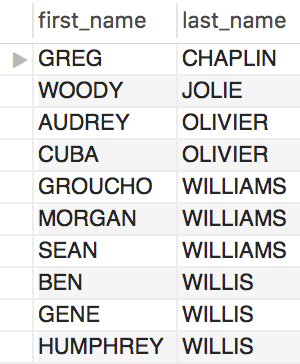

<p align="center">
  
</p>


# Description
Using MySQL's sample database __sakila__ - a schema that contains random data on a rental company and it's customers, films, payments, etc., you will read various SQL queries to display that data in many different ways. Without further ado here are those queries and the tables generated by them.

## Queries

```sql
USE sakila;

SELECT first_name, last_name
FROM  actor;
```
<p align="left">
  
</p>


```sql
SELECT UPPER(CONCAT(first_name, ' ', last_name)) AS `Actor Name`
FROM actor;
```
<p align="left">
  
</p>


```sql
SELECT actor_id, first_name, last_name
FROM actor
WHERE first_name = "Joe";
```
<p align="left">
  
</p>


```sql
SELECT first_name, last_name
FROM actor
WHERE last_name LIKE "%GEN%";
```
<p align="left">
  
</p>


```sql
SELECT first_name, last_name
FROM actor
WHERE last_name LIKE "%LI%"
ORDER BY last_name ASC, first_name ASC;
```
<p align="left">
  
</p>


```sql
SELECT country_id, country
FROM country
WHERE country IN ("Afghanistan", "Bangladesh", "China");
```
<p align="left">
  
</p>

Before adding middle_name column to actor table.
<p align="left">
  
</p>

After adding middle_name column to actor table.
```sql
ALTER TABLE actor
    DROP COLUMN middle_name;
```
<p align="left">
  
</p>


Removing the added column from the actor table.
```sql
ALTER TABLE actor
    DROP COLUMN middle_name;
```
<p align="left">
  
</p>


```sql
SELECT last_name, COUNT(last_name) AS multiples
FROM actor
GROUP BY last_name;
```
<p align="left">
  
</p>


```sql
SELECT last_name, COUNT(last_name) AS multiples
FROM actor
GROUP BY last_name
    HAVING multiples > 1;
```
<p align="left">
  
</p>


Actor 172's original name as listed in the database.
<p align="left">
  
</p>

After modifing actor 172's name.
```sql
UPDATE actor
SET first_name = "HARPO"
WHERE actor_id = 172;
```
<p align="left">
  
</p>

Using conditionals to modify actor 172's name.
```sql
UPDATE actor
SET first_name = IF(first_name="HARPO", "GROUCHO", "MUCHO GROUCHO")
WHERE actor_id = 172;
```
<p align="left">
  
</p>


```sql
CREATE TABLE address (
    address_id SMALLINT(4) AUTO_INCREMENT NOT NULL,
    address VARCHAR(50) NOT NULL,
    address2 VARCHAR(50),
    district VARCHAR(20) NOT NULL,
    city_id SMALLINT(5) NOT NULL,
    postal_code VARCHAR(10),
    phone VARCHAR(20) NOT NULL,
    location GEOMETRY NOT NULL,
    last_update TIMESTAMP DEFAULT CURRENT_TIMESTAMP ON UPDATE CURRENT_TIMESTAMP NOT NULL,
    PRIMARY KEY (address_id)
);
```
<p align="left">
  
</p>


```sql
SELECT s.first_name, s.last_name, a.address, c.city, cy.country
FROM staff AS s
INNER JOIN address AS a
    ON s.address_id = a.address_id
INNER JOIN city AS c
    ON a.city_id = c.city_id
INNER JOIN country AS cy
    ON c.country_id = cy.country_id;
```
<p align="left">
  
</p>


```sql
SELECT s.first_name, s.last_name, SUM(p.amount) AS total_rung_up
FROM payment AS p
INNER JOIN staff AS s
    ON p.staff_id = s.staff_id
WHERE p.payment_date >= '20050801' AND p.payment_date < '20050901'
GROUP BY s.staff_id;
```
<p align="left">
  
</p>


```sql
SELECT f.title, COUNT(f.title) AS num_actors
FROM film_actor AS fa
INNER JOIN film AS f
    ON fa.film_id = f.film_id
GROUP BY f.title;
```
<p align="left">
  
</p>


```sql
SELECT f.title, COUNT(f.title) AS num_inventory
FROM film AS f
INNER JOIN inventory AS i
    ON f.film_id = i.film_id
WHERE f.title = "Hunchback Impossible"
GROUP BY f.title;
```
<p align="left">
  
</p>


```sql
SELECT c.first_name, c.last_name, SUM(p.amount) AS total_paid
FROM payment AS p
INNER JOIN customer AS c
    ON p.customer_id = c.customer_id
GROUP BY c.first_name, c.last_name
ORDER BY c.last_name, c.first_name;
```
<p align="left">
  
</p>


```sql
SELECT title
FROM film
WHERE title LIKE "Q%" OR title LIKE "K%"
    AND language_id = (
        SELECT language_id
        FROM language
        WHERE name = 'English'
        );
```
<p align="left">
  
</p>


```sql
SELECT first_name, last_name
FROM actor
WHERE actor_id IN (
    SELECT actor_id
    FROM film_actor
    WHERE film_id = (
        SELECT film_id
        FROM film
        WHERE title =  "Alone Trip"
        )
    );
```
<p align="left">
  
</p>


```sql
SELECT c.first_name, c.last_name, c.email
FROM customer AS c
INNER JOIN address AS a
    ON c.address_id = a.address_id
INNER JOIN city AS cy
    ON a.city_id = cy.city_id
INNER JOIN country AS co
    ON cy.country_id = co.country_id
WHERE co.country = "Canada";
```
<p align="left">
  
</p>


```sql
SELECT title
FROM film
WHERE film_id IN (

    SELECT film_id
    FROM film_category
    WHERE category_id = (

        SELECT category_id
        FROM category
        WHERE name = "Family"
        )
    );
```
<p align="left">
  
</p>


```sql
SELECT f.title, COUNT(f.title) AS rent_count
FROM rental AS r
INNER JOIN inventory AS i
    ON r.inventory_id = i.inventory_id
INNER JOIN film AS f
    ON i.film_id = f.film_id
GROUP BY f.title
ORDER BY rent_count DESC;
```
<p align="left">
  
</p>


```sql
SELECT a.address, cy.city, co.country, SUM(p.amount) AS total_revenue
FROM store AS s
INNER JOIN address AS a
    ON s.address_id = a.address_id
INNER JOIN customer AS c
    ON s.store_id=c.store_id
INNER JOIN payment AS p
    ON p.customer_id = c.customer_id
INNER JOIN city AS cy
    ON cy.city_id = a.city_id
INNER JOIN country AS co
    ON co.country_id = cy.country_id
GROUP BY a.address, cy.city, co.country;
```
<p align="left">
  
</p>


```sql
SELECT s.store_id, a.address, cy.city, co.country
FROM store AS s
INNER JOIN address AS a
    ON s.address_id = a.address_id
INNER JOIN city AS cy
    ON cy.city_id = a.city_id
INNER JOIN country AS co
    ON co.country_id = cy.country_id;
```
<p align="left">
  
</p>


```sql
SELECT c.name, SUM(p.amount) AS gross_revenue
FROM category AS c
INNER JOIN film_category AS fc
    ON c.category_id = fc.category_id
INNER JOIN inventory AS i
    ON fc.film_id = i.film_id
INNER JOIN rental AS r
    ON i.inventory_id = r.inventory_id
INNER JOIN payment AS p
    ON r.rental_id = p.rental_id
GROUP BY name
ORDER BY gross_revenue DESC
LIMIT 5;
```
<p align="left">
  
</p>


This block of code creates a __View__ out of the last query and names it `top5_genre_gross_revenue`
```sql
CREATE VIEW top5_genre_gross_revenue AS
SELECT c.name, SUM(p.amount) AS gross_revenue
FROM category AS c
INNER JOIN film_category AS fc
    ON c.category_id = fc.category_id
INNER JOIN inventory AS i
    ON fc.film_id = i.film_id
INNER JOIN rental AS r
    ON i.inventory_id = r.inventory_id
INNER JOIN payment AS p
    ON r.rental_id = p.rental_id
GROUP BY name
ORDER BY gross_revenue DESC
LIMIT 5;
```


```sql
SELECT * FROM top5_genre_gross_revenue;
```
<p align="left">
  
</p>


This block of code removes the __View__ `top5_genre_gross_revenue` if it exists from the sakila schema.
```sql
DROP VIEW IF EXISTS top5_genre_gross_revenue;
```